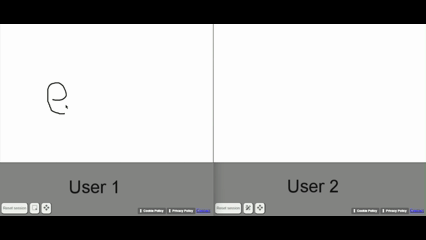

*Html, Css, Js, SQL, Php*

An online simplified version of Paint. Useful to share notes with other users.

The canvas can be visualised and edited by unlimited number of users. No need to log in, just open the page!

The project was developed only in Html, Js, Css, SQL and Php without using libraries and frameworks.
The web page is available [here](https://provsito.altervista.org/paint/index.php).

