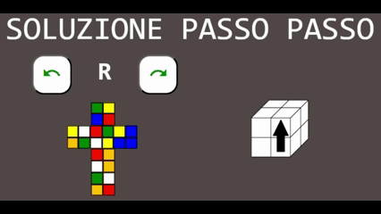

*Html, Css, Js*

An online 2x2x2 Rubik's cube solver with step by step solution.

The project was developed only in Html, Js and Css without using libraries and frameworks.
The web page is available [here](https://provsito.altervista.org/cubo/index.php).

